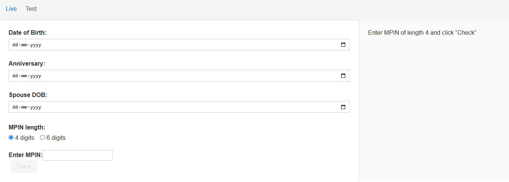
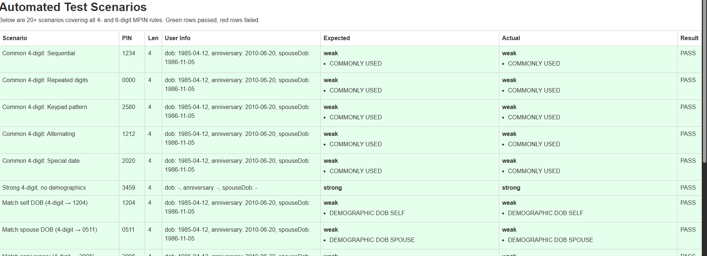

# MPIN Strength Checker

A **React + TypeScript** demo app that evaluates the strength of user-supplied MPINs based on common-usage patterns and user demographics (Date of Birth, Anniversary, Spouse’s DOB), including “cross-date” combinations. It includes an automated test suite with 20+ scenarios to prove correctness.


---

# HOSTED LINK

https://onebanc-mpin.vercel.app/

---

## 🔍 Features

1. **Live Mode** (`/live` route)  
   - Enter three dates (DOB, Anniversary, Spouse DOB)  
   - Choose MPIN length (4 or 6 digits)  
   - Enter MPIN and see:
     - **Weak** (red) or **Strong** (green)
     - Reasons for weakness:
       - `COMMONLY_USED`
       - `DEMOGRAPHIC_DOB_SELF`, `DEMOGRAPHIC_DOB_SPOUSE`, `DEMOGRAPHIC_ANNIVERSARY`
       - `DEMOGRAPHIC_CROSS_DATES_*` for 4-digit mixed-date patterns
       



2. **Test Mode** (`/test` route)  
   - Runs 20+ predefined test cases  
   - Displays a table of **Scenario**, **Inputs**, **Expected vs Actual**, **PASS/FAIL**  
   - Green rows = passed; red rows = failed
   
   - Two Test cases failed as they were expected not to be common but they were according to our dataset
   - Last Two cases are the HAPPY PATH to this assignment i.e. Strong+Demographics.
  

---

## 🏗️ Project Structure

```
mpin-demo/
├── public/
│   └── index.html
├── src/
│   ├── App.tsx           
│   ├── index.css         
│   ├── main.tsx          
│   ├── components/       
│   │   ├── DemographicsForm.tsx / .css
│   │   ├── MPINSelector.tsx      / .css
│   │   ├── MPINInput.tsx         / .css
│   │   └── TestCaseList.tsx      / .css
│   ├── routes/
│   │   ├── Live.tsx       
│   │   └── Test.tsx       
│   └── utils/
│       ├── mpinEvaluator.ts      
│       └── testCases.ts          
├── README.md
├── package.json
├── tsconfig.json
└── vite.config.ts
```

---

## ▶️ Getting Started


---

## 🧩 MPIN Logic Overview

1. **Common-PIN detection**  
   - Sequential, repeats, keypad patterns, mirror, alternating, double-pairs, special dates, plus extra popular picks.

2. **Demographic patterns**  
   - From each ISO date (`YYYY-MM-DD`), extract `DD`, `MM`, `YY` segments.  
   - Generate all six 4-digit combos and six 6-digit permutations.

3. **Cross-date patterns** (4-digit only)  
   - Mix any 2-digit segment from one date with any 2-digit segment of another.

4. **Strength outcome**  
   - **Weak** if any rule matches; otherwise **Strong**.

---

## ✅ Automated Tests

- 20+ scenarios in `src/utils/testCases.ts`  
- Covers all rules and edge cases  
- View results on the **Test** page

---

## 🚀 Deployment

Deploy to Vercel:

```bash
npm install -g vercel
vercel
# Build Command: npm run build
# Output Directory: dist
vercel --prod
```

---
